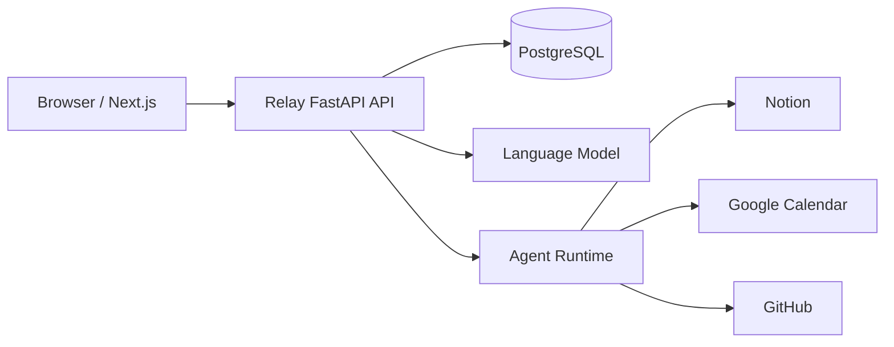
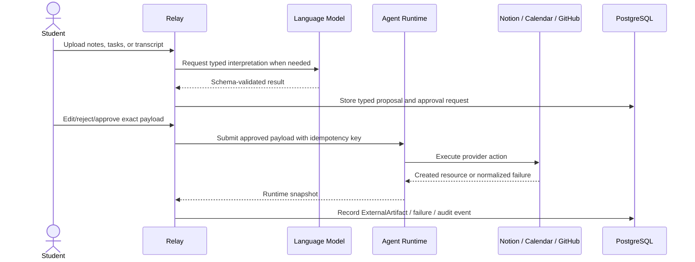

# Relay

Relay is a student workflow automation platform that turns lectures, deadlines, and project meetings into structured, human-approved actions across Notion, Google Calendar, and GitHub.

Relay's core thesis is simple: probabilistic interpretation can help understand messy student work, but deterministic typed actions and human approval must control every external side effect. The product separates interpretation, planning, approval, execution, and provider artifact records so a user can see exactly what will happen before Relay writes to another system.

## Problem

Students keep academic work across lecture notes, syllabi, calendars, Notion workspaces, GitHub repositories, and meeting transcripts. Generic assistants can summarize or suggest actions, but they often blur the line between a guess and an irreversible write. Relay turns that gap into an explicit workflow: understand the input, validate a typed proposal, let the student edit and approve it, execute through a runtime boundary, then record the artifact that was actually created.

## Three workflows

| Workflow                        | Implemented flow                                                                                                                              |
| ------------------------------- | --------------------------------------------------------------------------------------------------------------------------------------------- |
| LEARN (`lecture_to_notion`)     | Lecture notes -> structured review -> approval -> Notion study page.                                                                          |
| PLAN (`study_scheduler`)        | Notion tasks + Google Calendar availability -> CP-SAT schedule -> review -> approval -> Google Calendar study blocks.                         |
| COLLABORATE (`project_meeting`) | Meeting transcript -> typed decisions/actions -> identity resolution -> review -> approval -> Notion tasks and GitHub issues/review requests. |

LEARN accepts PDF, DOCX, Markdown, and plain text sources, parses them locally, generates typed study notes, and publishes to a selected Notion parent page after approval. PLAN imports Notion tasks, loads Google Calendar availability, combines saved preferences with hard scheduling constraints, solves a deterministic CP-SAT schedule, and creates approved calendar blocks. COLLABORATE parses transcripts, extracts typed decisions/action items, resolves owners against project members, validates repository context where possible, and executes approved Notion/GitHub actions independently so partial success remains truthful.

## Architecture



The domain layer contains lifecycle rules, typed errors, preference rules, and ports. Application services own transactional workflow orchestration, approval gates, audit events, and owner-scoped access. Provider SDK details stay behind connector services and typed schemas. `ExternalArtifact` records provider side effects with idempotency keys and external URLs; it is the source of truth for what Relay actually created.

Important boundaries:

- AI interpretation is separate from deterministic domain logic.
- Approval payloads are immutable snapshots, separate from later execution.
- Relay owns users, OAuth, workflow state, approvals, and artifact records.
- Agent Runtime owns execution attempts, provider calls, runtime status, and operational retry behavior.
- Workflow state is mapped from runtime state in one place instead of leaking runtime enums through the product.



## Relay ? Agent Runtime boundary

Relay submits only approved action snapshots through the `RuntimeClient` contract. The request contains `workflow_run_id`, `proposed_action_id`, `action_type`, `approved_payload`, `idempotency_key`, and `correlation_id`; it does not include ORM objects, provider SDK clients, or service credentials. Local development and tests use `LocalRuntimeClient`; production-style configuration can use `AgentRuntimeHttpClient` with server-side `AGENT_RUNTIME_BASE_URL` and `AGENT_RUNTIME_API_KEY`.

Timeouts, transport failures, and rate limits are treated as uncertain runtime state rather than confirmed execution failure. Retry paths reuse the same approved payload and idempotency key. COLLABORATE records each action independently, so a successful Notion task is not discarded because a sibling GitHub write failed.

## Tech stack

- Frontend: Next.js 16, React 19, TypeScript, TanStack Query, Zod, Playwright.
- Backend: FastAPI, Pydantic v2, SQLAlchemy 2, Alembic, FastAPI Users, Fernet credential encryption.
- Data/execution: PostgreSQL, local SQLite test databases, OR-Tools CP-SAT, HTTP runtime adapter, provider-specific connectors.
- Integrations: OpenAI-compatible typed model adapter, Notion OAuth/API, Google OAuth/Calendar API, GitHub OAuth/API.
- Tooling: Ruff, mypy, ESLint, Prettier, Docker Compose, GitHub Actions.

## Key engineering decisions

- Structure-aware document parsing keeps source references and avoids sending raw documents through list/detail APIs.
- Typed AI outputs turn model responses into validated domain objects before proposals are created.
- CP-SAT scheduling handles hard availability/deadline constraints more defensibly than asking a model to place calendar blocks.
- Human approval is mandatory before provider side effects.
- Approved payload immutability prevents edits from silently changing authorized work.
- Provider data is normalized into Relay schemas before entering workflow logic.
- Application-level idempotency protects retries across Notion, Google Calendar, GitHub, and runtime boundaries.
- Partial completion is explicit; successful artifacts remain recorded instead of attempting distributed rollback.

See [ADRs](docs/decisions) for the decision log.

## Reliability / human approval

Every workflow reaches `AWAITING_APPROVAL` before execution, and every approved action is stored as an exact payload snapshot. Approve/reject operations are owner-scoped and serialized by run-level locking. Audit records track state changes, approval decisions, runtime submissions, recoverable runtime failures, provider outcomes, and artifact recording without storing secrets or large source content.

Provider credentials are encrypted at rest with Fernet and decrypted only server-side. OAuth disconnects clear encrypted tokens and provider metadata. Normal CI and local demo mode use fake language-model output, mock connectors, and local runtime behavior, so external credentials are optional for development.

## Local setup

Prerequisites: Python 3.12, Node.js 24 LTS with npm, Docker with Compose v2. GNU Make is optional.

From the repository root:

```sh
python scripts/dev.py setup
python scripts/dev.py dev
```

Setup creates `backend/.venv`, installs pinned dependencies, and copies `.env.example` / `frontend/.env.example` without overwriting existing local values. Dev starts PostgreSQL, applies migrations, and runs the backend and frontend. When PostgreSQL is already running and the schema is current, `python scripts/dev.py dev-fast` skips Docker and migrations for faster UI/backend testing.

Useful URLs:

- Relay: <http://localhost:3000>
- Signup: <http://localhost:3000/signup>
- API liveness: <http://localhost:8000/health>
- API docs: <http://localhost:8000/docs>

No OAuth keys are required for mock/local flows. To use real integrations locally, set `TOKEN_ENCRYPTION_KEY` and the relevant Notion, Google, or GitHub OAuth values in `.env`. To call a real model, set `LANGUAGE_MODEL_PROVIDER=openai` and `OPENAI_API_KEY`. To use a separate Agent Runtime service, set `RUNTIME_BACKEND=agent_runtime`, `AGENT_RUNTIME_BASE_URL`, and `AGENT_RUNTIME_API_KEY`. Never commit real credentials or expose them as `NEXT_PUBLIC_*` settings.

| Make command   | Portable equivalent             | Purpose                                       |
| -------------- | ------------------------------- | --------------------------------------------- |
| `make setup`   | `python scripts/dev.py setup`   | Install dependencies and initialize env files |
| `make dev`     | `python scripts/dev.py dev`     | Start DB, migrate, run apps                   |
| `make dev-fast` | `python scripts/dev.py dev-fast` | Run apps only; skip DB startup and migrations |
| `make test`    | `python scripts/dev.py test`    | Backend tests and browser flows               |
| `make lint`    | `python scripts/dev.py lint`    | Ruff, mypy, ESLint, Prettier, TypeScript      |
| `make build`   | `python scripts/dev.py build`   | Production frontend build                     |
| `make migrate` | `python scripts/dev.py migrate` | Upgrade database to head                      |
| `make db-up`   | `python scripts/dev.py db-up`   | Start PostgreSQL and wait for health          |
| `make db-down` | `python scripts/dev.py db-down` | Stop DB without deleting data                 |

## Testing

Backend tests cover domain rules, API authorization, approval immutability, credential encryption, provider connector mocks, workflow integration, runtime HTTP normalization, idempotency/recovery, migration drift, and PostgreSQL-specific locking when `RELAY_TEST_DATABASE=1` is set. Frontend Playwright tests exercise signup, protected routing, onboarding/workspace surfaces, connection setup affordances, preferences, and the LEARN mock publish path.

```sh
python scripts/dev.py lint
python scripts/dev.py test
python scripts/dev.py build
```

Normal CI does not require OpenAI, Notion, Google, GitHub, or a live Agent Runtime service. External integration testing is manual/optional and requires local credentials.

## Known limitations

- Provider APIs cannot guarantee exactly-once side effects; Relay mitigates with application idempotency keys and artifact checks.
- Runtime status sync uses bounded polling rather than webhook callbacks.
- GitHub integration uses OAuth today; a GitHub App would allow narrower repository-scoped installation permissions.
- Transcript parsing expects text-oriented meeting notes, not audio/video transcription.
- CP-SAT objective weights are heuristic and should be tuned with real student feedback.
- Local/demo document storage is filesystem-based; production deployment needs durable object storage and operational backups.
- Account recovery, email verification, edge abuse protection, and production observability are documented but not fully implemented.

## Documentation map

- Architecture: [system context](docs/architecture/system-context.md), [container diagram](docs/architecture/container-diagram.md), [domain model](docs/architecture/domain-model.md), [workflow state machine](docs/architecture/workflow-state-machine.md), [runtime boundary](docs/architecture/relay-agent-runtime-boundary.md).
- Workflow details: [LEARN](docs/architecture/learn-workflow.md), [PLAN](docs/architecture/plan-sequence.md), [COLLABORATE](docs/architecture/collaborate-sequence.md), [scheduling engine](docs/architecture/scheduling-engine.md), [document processing](docs/architecture/document-processing.md).
- Integrations/security: [Notion](docs/integrations/notion.md), [Google Calendar](docs/integrations/google-calendar.md), [GitHub](docs/integrations/github.md), [OAuth security](docs/security/oauth.md), [credential storage](docs/security/credential-storage.md), [external connections](docs/security/external-connections.md), [AI and document handling](docs/security/ai-and-document-handling.md).

## License

MIT. See [LICENSE](LICENSE).

