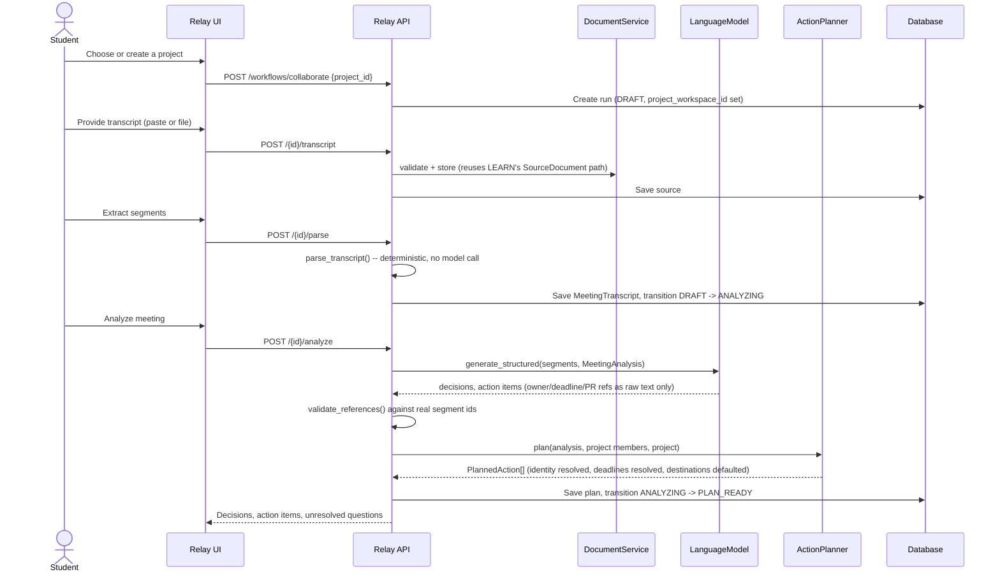
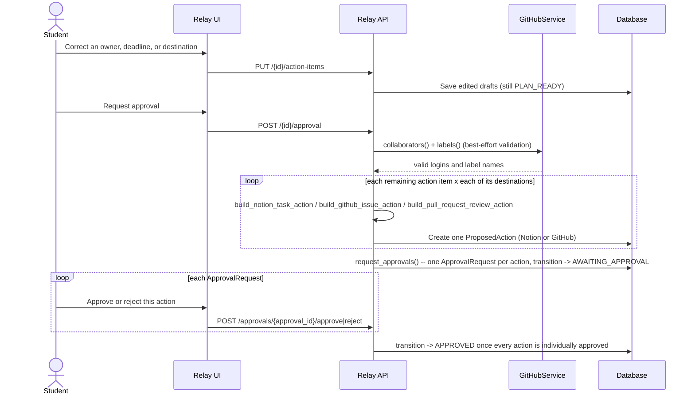

# COLLABORATE sequence

## Transcript through plan-ready analysis



Extraction is the only step that calls a language model. Everything after it -- identity resolution, deadline resolution, destination defaults, and the eventual typed payloads -- is ordinary deterministic code, exercised directly by unit tests with no model involved.

## Review, approval, and the multi-action shape



A run's `AWAITING_APPROVAL` -> `APPROVED` transition already required every action's approval to be `APPROVED` before this phase (see `docs/architecture/workflow-state-machine.md`); COLLABORATE is simply the first workflow where "every action" is routinely more than one. "Approve Selected" happens by removing an unwanted draft during review, before any `ProposedAction` exists for it -- not by leaving one action's approval pending forever while others proceed.

## Independent execution and partial completion

```mermaid
sequenceDiagram
    actor Student
    participant UI as Relay UI
    participant API as Relay API
    participant Runtime as LocalRuntimeClient
    participant Notion as NotionApiClient
    participant GitHub as GitHubApiClient
    participant DB as Database

    Student->>UI: Create approved Notion and GitHub work
    UI->>API: POST /{id}/execute
    API->>DB: transition APPROVED -> QUEUED -> EXECUTING
    loop each approved action, independently
        API->>Runtime: submit_execution(operation, approved_payload, "collaborate:{run}:{action}")
        alt create_notion_task
            Runtime->>Notion: POST /v1/pages (parent: database)
        else create_github_issue
            Runtime->>GitHub: POST /repos/{owner}/{name}/issues
        else request_github_pr_review
            Runtime->>GitHub: POST .../pulls/{n}/requested_reviewers
        end
        alt succeeds
            Runtime-->>API: result with external_id/external_url
            API->>DB: Record ExternalArtifact (notion_task / github_issue / github_review_request)
        else fails
            Runtime-->>API: raises; caught per action
        end
    end
    API->>DB: succeeded == total -> COMPLETED
    API->>DB: 0 < succeeded < total -> PARTIALLY_COMPLETED (artifacts kept)
    API->>DB: succeeded == 0 -> FAILED
    API-->>UI: result_payload {succeeded_count, failed_count, total_count}
```

Unlike PLAN (one `ProposedAction` containing many calendar-block sub-events, aggregated inside `LocalRuntimeClient`), COLLABORATE's actions are already independent `ProposedAction` rows, so the aggregation happens one level up, in `CollaborateExecutionService`, over N separate `RuntimeClient.submit_execution` calls. Both arrive at the same truthful outcome: successfully created artifacts are never discarded because a sibling action failed, and the run's terminal state says exactly how much of what was approved actually happened.
