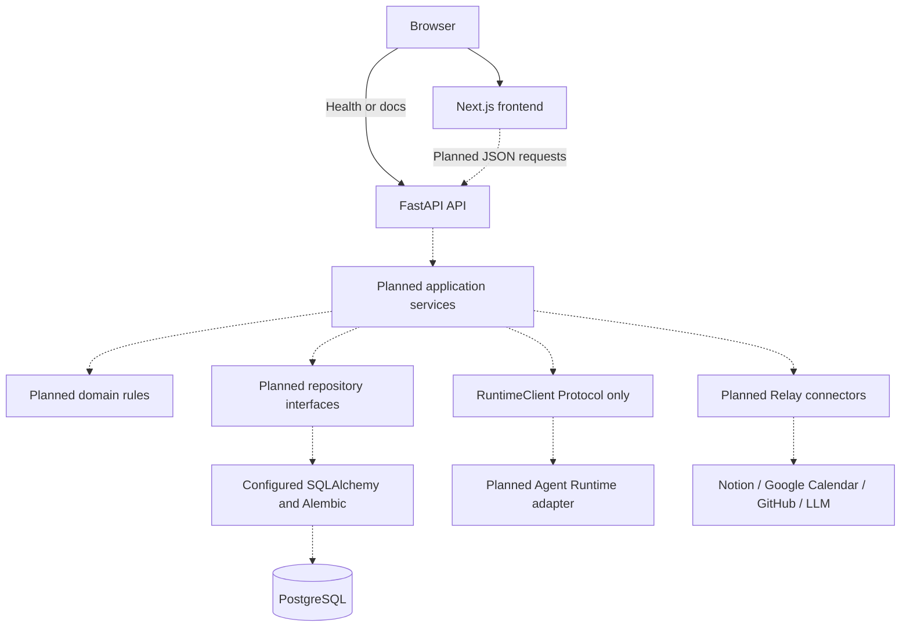

# Containers and dependency direction

Local processes: browser-facing Next.js on 3000, FastAPI on 8000, and Compose PostgreSQL on localhost 5432. Only PostgreSQL is containerized. There is no worker or runtime service in this repository.

Routes will translate HTTP requests and responses, delegate to services, and avoid business rules. Services will coordinate domain validation, repositories, and connector/runtime ports. Domain code must not import FastAPI, provider SDKs, or transport clients. SQLAlchemy and concrete transport adapters are infrastructure; API schema models are distinct from future persistence models.

Synchronous SQLAlchemy is sufficient for this foundation. Future blocking DB work must run in synchronous handlers/dependencies or an appropriate thread context, not block the async event loop. No runtime submit endpoint exists.
