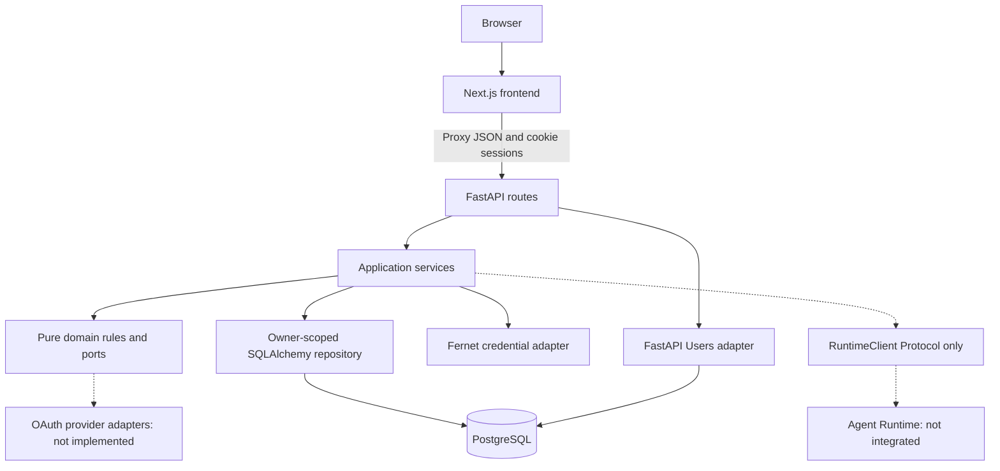

# Containers and dependency direction

Next.js runs on 3000, FastAPI on 8000, and Compose PostgreSQL on localhost 5432. Only PostgreSQL is containerized. The browser uses a same-origin proxy; cookies never enter localStorage. Protected layouts validate sessions server-side and FastAPI authorizes every resource independently.

The domain package contains pure rules and ports. Application services import the domain plus persistence/API schemas and coordinate atomic transactions. The repository encapsulates owner-scoped queries and locks. The current application repository is a concrete SQLAlchemy adapter; there is no speculative generic repository framework. Infrastructure-specific encryption implements the domain CredentialStore port. Provider adapters and Runtime transports are absent.

Async SQLAlchemy application sessions accommodate FastAPI Users and avoid blocking the event loop. Alembic/diagnostics use the synchronous psycopg driver; application requests use asyncpg. No background worker or task queue is installed -- execution stays in-process and synchronous (`LocalRuntimeClient`). A CP-SAT scheduling solver (OR-Tools, `app/scheduling/`), document processors (PyMuPDF, python-docx), and a model provider (OpenAI, behind a fake-provider default for tests) are installed and used directly by request handlers, not by a separate worker tier.
