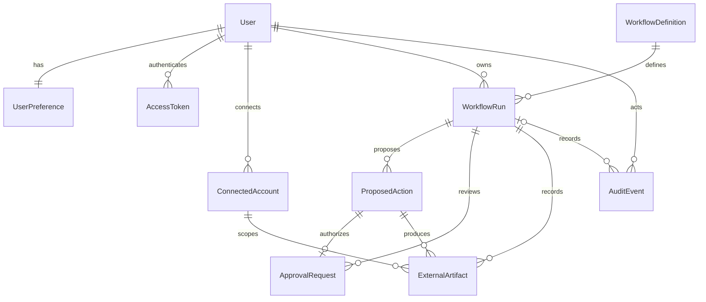

# Domain model

Relay stores student-domain state in PostgreSQL. Pure enums, validation, transition rules, typed errors, and credential/OAuth ports live under `app/domain`; they import neither FastAPI nor SQLAlchemy. Application services coordinate these rules with the SQLAlchemy repository. Explicit Pydantic response schemas keep ORM objects and secrets out of API responses.

Users receive default preferences and a USER_CREATED audit event atomically during registration. Email uniqueness includes a case-insensitive index. Preferences use local wall-clock times plus an IANA timezone; the current policy is a same-day study window, sessions from 5 to 480 minutes, preferred <= maximum, and breaks from 0 to 240 minutes. Overnight study windows are intentionally unsupported until scheduling semantics are designed.

The three definition keys are `lecture_to_notion`, `study_scheduler`, and `project_meeting`. Alembic seeds version 1 exactly once. Running `upgrade head` again creates no duplicates. Enabled means a user can create a DRAFT, not that automation is implemented. Definitions are versioned by `(key, version)` and runs reference a specific version.

JSONB is used for workflow inputs/plans/results, proposed and approved payloads, audit metadata, and provider scope lists. Ownership, state, identities, dates, risk, providers, and relationships are typed columns. No entity is a generic JSON document.

## Constraints and indexes

- Connected accounts are unique by `(user_id, provider, external_account_id)`; provider endpoints return lists because one user may eventually connect multiple accounts. Provider-level disconnect revokes all of that user's records for the provider.
- Approvals have one record per action in this phase. Composite foreign keys keep approval/artifact action IDs tied to the same workflow run. An approved record requires a payload and resolver; pending records have no resolution timestamp.
- External artifacts have globally unique idempotency keys and `(connected_account_id, artifact_type, external_id)` uniqueness. External IDs are scoped to accounts rather than assumed globally unique. LEARN creates artifacts only through approved execution.
- Run lists index owner/creation time and state. Connections index owner/provider. Approval requests index run. Audit events index run/time. Results are bounded; run and approval list APIs accept pagination parameters.
- Audit mutation is unavailable through the API and guarded against ORM update/delete. Resolved approvals reject ORM updates. Privileged raw SQL remains outside this application-level protection; a future production DB role policy can enforce stronger append-only restrictions.

## Persistence and migrations

`0002_core_domain` creates the domain and session tables; `0003_workflow_definitions` seeds the supported definitions. Migrations are static and do not import mutable application models. The Alembic environment imports current models only for drift detection. Normal startup never calls `create_all`.

Tests apply real migrations even to temporary SQLite databases. With `RELAY_TEST_DATABASE=1`, API/service fixtures use isolated PostgreSQL schemas and test actual row locking. CI also checks schema drift and downgrade/re-upgrade. Downgrading seeded definitions fails safely if runs reference them; downgrade is a disposable-database operation, not a data-retention policy.
