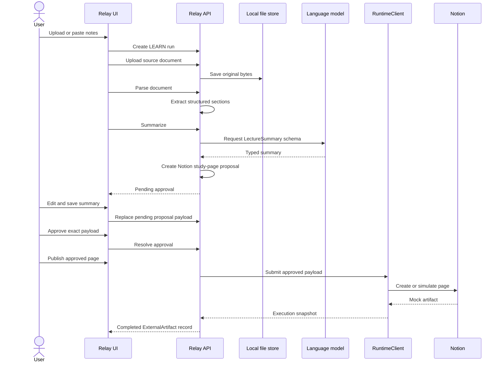

# LEARN workflow

LEARN is the first implemented Relay workflow. It turns a user-owned lecture source into a typed study-page proposal, lets the user edit the proposal, records an immutable approved payload, and executes an approved Notion publish through the runtime boundary.

The workflow definition key is `lecture_to_notion`. It uses the existing workflow state machine:

## Backend responsibilities

`LectureNotesWorkflowService` owns LEARN orchestration. It creates a generic workflow run, validates and stores one private source document, advances from `DRAFT` to `ANALYZING`, persists parsed sections, calls the typed summary service, creates a generic `ProposedAction`, and requests the existing generic approval.

The service does not expose storage keys or raw extracted text in list/detail payloads. Detail responses include document metadata and section identities so generated `source_refs` can be shown and validated without echoing the whole lecture source.

`ExecutionService` only runs after the generic approval service has resolved an approval to `APPROVED` with an immutable `approved_payload`. Execution submits that snapshot through the `RuntimeClient` contract with an idempotency key. The local runtime persists the request and snapshot in `local_execution`; successful publishing records an `external_artifact`.

## Frontend responsibilities

The LEARN workspace has two routes:

- `/workflows/learn`: upload a PDF, DOCX, Markdown, or text file, or paste plain text.
- `/workflows/learn/{id}`: inspect source status, parse, summarize, edit notes, approve, execute, and view the recorded artifact.

Generic run detail and approval pages link LEARN runs into the richer review route. PLAN and COLLABORATE continue to use draft-only generic surfaces.

## Provider modes

`LANGUAGE_MODEL_PROVIDER=fake` is the default and is deterministic for tests and local demos. `LANGUAGE_MODEL_PROVIDER=openai` uses the OpenAI Responses API with schema parsing, no retries, configured timeout, and `store=false`. `NOTION_PUBLISH_MODE=mock` keeps publishing isolated; `NOTION_PUBLISH_MODE=real` uses an encrypted Notion connection and selected destination.

OpenAI integration is a provider adapter behind `LanguageModel`; the LEARN workflow service receives only typed `LectureSummary` values or safe domain errors.

## Out of scope

LEARN does not retrieve content from Notion, perform OCR, or implement retrieval-augmented generation.
