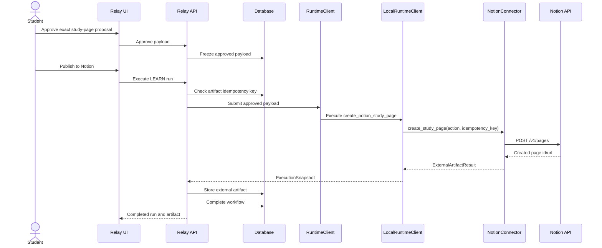
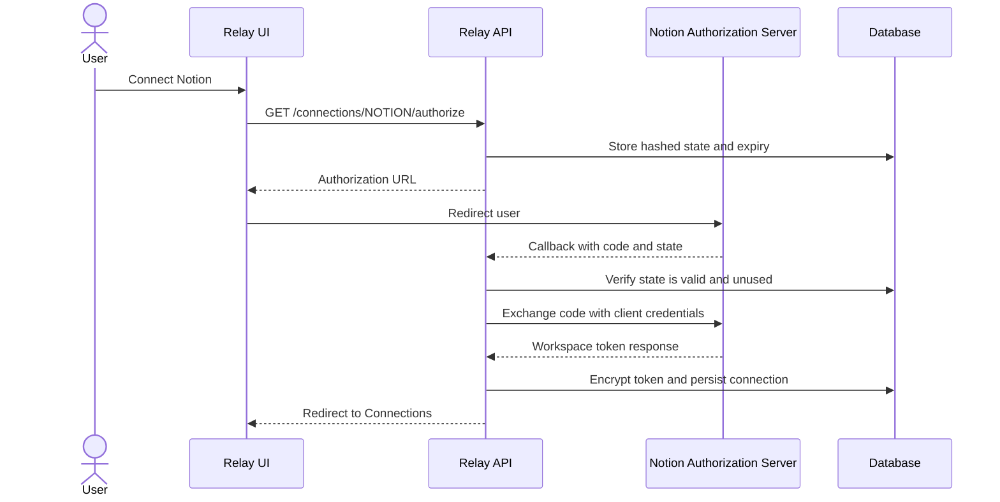

# Notion publishing architecture

Real Notion publishing is intentionally hidden behind the connector interface. Workflow services create approved Relay actions; connector code owns OAuth, destination discovery, API requests, provider errors, and Notion block formatting.

## OAuth sequence

## Verification decision

For page creation, Notion's create response includes the created page id and URL. Relay treats that response as sufficient confirmation and records the artifact. It avoids an extra read call because the create response is the trusted write acknowledgement and additional reads can introduce new permission/rate-limit failure modes after success.
