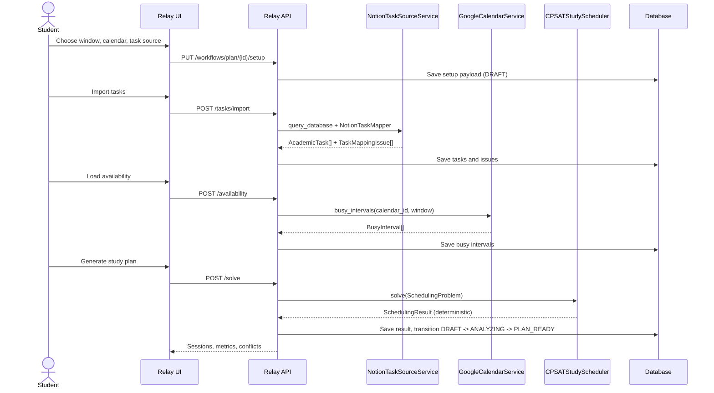
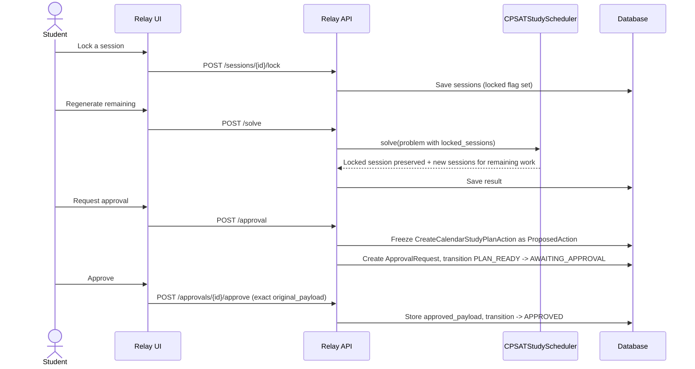

# PLAN sequence

## Setup through first schedule



Every step from setup through the first `solve()` requires the run to still be `DRAFT`; once `PLAN_READY`, setup calls are refused (`PLAN_WORKFLOW_INVALID_STATE`, 409) so a pending review can never be edited out from under itself. `solve()` remains callable again while `PLAN_READY` (regeneration), but not once `AWAITING_APPROVAL`, for the same reason -- see `StudyPlanWorkflowService.solve` and `.adjust_sessions`.

## Review, lock, regenerate, approve



The approved payload is the exact set of `CreateCalendarStudyBlockAction`s built from the sessions at request-approval time. There is no second solver or model call after this point -- execution only ever reads `approval.approved_payload`.

## Execution and partial failure

```mermaid
sequenceDiagram
    actor Student
    participant UI as Relay UI
    participant API as Relay API
    participant Runtime as LocalRuntimeClient
    participant Connector as DatabaseGoogleCalendarConnector
    participant Google as Google Calendar API
    participant DB as Database

    Student->>UI: Create approved calendar blocks
    UI->>API: POST /execute
    API->>DB: transition APPROVED -> QUEUED -> EXECUTING
    API->>Runtime: submit_execution(approved_payload, idempotency_key)
    Runtime->>DB: Check idempotency_key (LocalExecution)
    loop each approved study block, independently
        Runtime->>Connector: create_study_block(event, key:index)
        Connector->>Google: POST /calendars/{id}/events
        alt succeeds
            Google-->>Connector: event id/url
            Connector-->>Runtime: CalendarEventResult
        else fails (rate limit, timeout, ...)
            Connector-->>Runtime: raises; caught per-event
        end
    end
    Runtime-->>API: ExecutionSnapshot (SUCCEEDED / PARTIAL / FAILED)
    API->>DB: Record ExternalArtifact for every block actually created
    alt all succeeded
        API->>DB: transition -> COMPLETED
    else some succeeded, some failed
        API->>DB: transition -> PARTIALLY_COMPLETED (artifacts kept)
    else none succeeded
        API->>DB: transition -> FAILED
    end
    API-->>UI: created/failed counts, error_code
```

## Partial-failure decision

Each calendar block is created in its own `try`/`except` inside `LocalRuntimeClient.submit_execution` (the `PLAN_OPERATION` branch) -- one failing event does not abort the events already created for other tasks, and the successes are still recorded. `ExecutionStatus` has a `PARTIAL` value alongside `SUCCEEDED`/`FAILED` specifically so `StudyPlanExecutionService.execute` can tell "created some, not all" apart from "created none," and reports it as `WorkflowStatus.PARTIALLY_COMPLETED` -- the same terminal state the state machine already reserved for this since its first migration. `ProposedAction.status` has no partial variant (unlike `WorkflowStatus`, which already anticipated this at the database level); a not-fully-completed action is recorded as `FAILED` at the action level while the *run*-level status and `result_payload` (`created_count`, `failed_count`, `approved_count`) carry the truthful, granular outcome. `PARTIALLY_COMPLETED` is terminal in `TRANSITIONS` -- there is no automatic retry of the failed remainder; a student sees exactly what succeeded (with real calendar links, via the recorded `ExternalArtifact`s) and what didn't.

## Idempotency

Two layers, matching the Notion pattern in `docs/integrations/notion.md`:

1. **Whole-batch**: `LocalExecution.idempotency_key` (`plan:{run_id}:{approval_id}`) short-circuits re-execution of an already-submitted batch, returning the stored snapshot unchanged.
2. **Per-event**: `ExternalArtifact.idempotency_key` (`plan:{run_id}:{approval_id}:{event_index}`) is checked before creating each artifact row, so even if execution logic ran twice for the same event, no duplicate `ExternalArtifact` (and, in practice, no duplicate Google event, since the per-event key is also embedded in the outbound request) would result.
