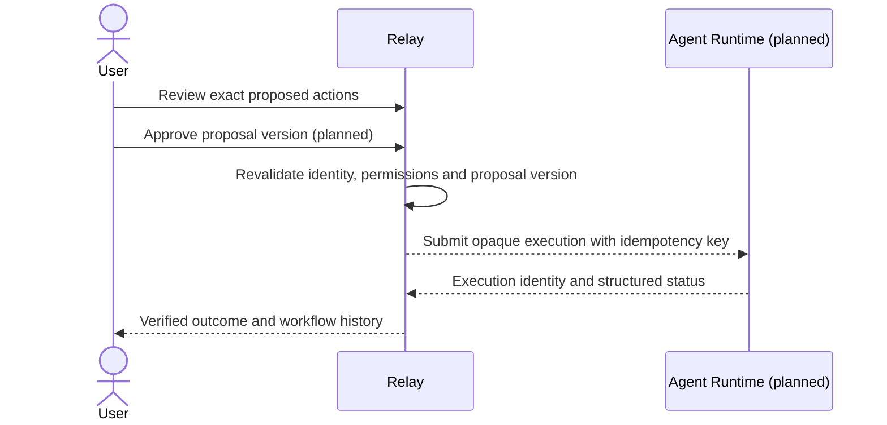

# Relay and Agent Runtime boundary

Relay owns what should happen; Agent Runtime owns reliable execution. They remain separate repositories and deployable systems.

| Relay | Agent Runtime |
| --- | --- |
| Users, OAuth configuration, account connections | Asynchronous execution and workers |
| Document processing and AI interpretation | Queues, retries, backoff, timeouts |
| Learn, Plan, Collaborate and scheduling | Cancellation and execution state |
| Proposals, validation, approval and history | Idempotency support and structured results |
| Connector-specific domain behavior | Tracing and operational metrics |

`backend/app/runtime/client.py` defines a typed asynchronous `RuntimeClient` Protocol with submit, get, and cancel methods. Requests carry an operation identifier, JSON payload, and idempotency key. Snapshots carry execution identity, state, optional result, error code, and timestamps.

`LocalRuntimeClient` exists for the LEARN slice. It is an in-process adapter that persists local execution snapshots and calls either `MockNotionConnector` or a DB-backed real Notion connector after approval. `AgentRuntimeHttpClient` remains a future adapter. Runtime must not interpret lectures, assignments, courses, study sessions, Notion tasks, or GitHub issues. An eventual opaque operation payload is not permission to teach Runtime domain rules.

Approval requests and exact payload snapshots exist in Relay. LEARN submits only approved payloads through the runtime boundary. Relay binds the selected Notion account and destination before approval. Edits invalidate pending approval payloads. Runtime submission is not a substitute for approval or authorization. Partial success and stale provider state must remain visible to the user; retries must not duplicate side effects.

Before Agent Runtime integration, agree operation registration, credential access, callback/connector execution placement, error taxonomy, cancellation races, result verification, authentication, tenant isolation, and idempotency retention. Credentials should not become arbitrary payload fields. Runtime cancellation will be best effort; completed external actions cannot be assumed reversible. No retry loop, queue, or remote execution-state persistence is implemented in Relay.
