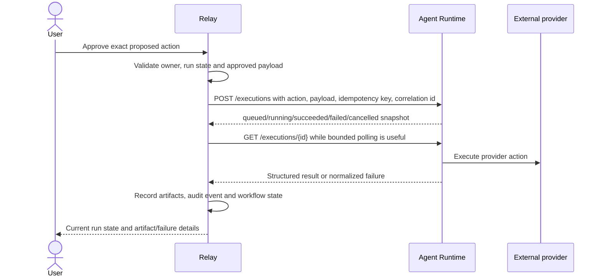

# Relay and Agent Runtime boundary

Relay owns what should happen; Agent Runtime owns reliable execution. They remain separate deployable systems connected through Relay's `RuntimeClient` port.

| Relay | Agent Runtime |
| --- | --- |
| Users, OAuth configuration, account connections | Asynchronous execution and workers |
| Document/transcript processing and AI interpretation | Queues, retries, backoff and timeouts |
| LEARN, PLAN, COLLABORATE planning and approval | Cancellation and execution state |
| Proposed actions, immutable approved payloads and audit history | Runtime status, telemetry and idempotent execution |
| External artifact records and user-facing workflow state | Structured execution results |

`backend/app/runtime/client.py` defines the Relay-owned contract: `submit_execution`, `get_execution`, and `cancel_execution`. The HTTP adapter is `AgentRuntimeHttpClient`; tests and local development can still use `LocalRuntimeClient`.

Relay submits only the exact approved action snapshot. The runtime request contains `workflow_run_id`, `proposed_action_id`, `action_type`, `approved_payload`, `idempotency_key`, and `correlation_id`. Relay never sends ORM objects, provider SDK clients, or service credentials in that payload. Runtime credentials come only from server-side `AGENT_RUNTIME_BASE_URL` and `AGENT_RUNTIME_API_KEY` when `RUNTIME_BACKEND=agent_runtime`.

Runtime states are translated in one place: `queued -> QUEUED`, `running -> EXECUTING`, `succeeded -> COMPLETED`, `failed -> FAILED`, and `cancelled -> CANCELLED`. PLAN and COLLABORATE retain partial-completion behavior: successful sibling actions remain recorded when another approved action fails. Relay does not perform distributed rollback.

Cancellation is best effort. Relay validates ownership and state, records the cancel request, calls `RuntimeClient.cancel_execution` when a runtime execution id exists, and syncs a cancelled snapshot. Completed external side effects are not rolled back.

Transport uncertainty is not treated as confirmed execution failure. Timeouts and unavailable-runtime errors stay recoverable: approved payloads and idempotency keys remain in Relay, so retrying the same logical action uses the same key. Rate-limit responses follow the same recoverable path. Relay records only safe workflow, action, correlation, and error-code identifiers in audit metadata; it does not log approved payload content or provider tokens.

Normal CI uses mocks and local runtime behavior. Live Agent Runtime verification should be run as an optional integration test once the service is deployed with the documented endpoints.
