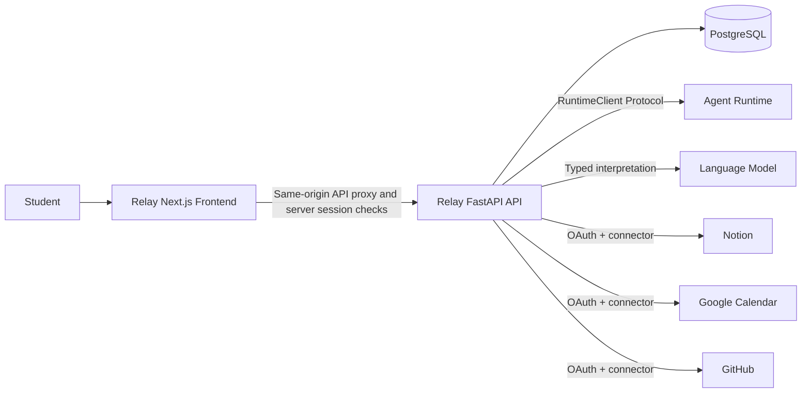

# System context

Solid edges are implemented relationships. External service calls can run in mock/local modes for development and CI.

Relay accounts, sessions, preferences, workflow runs, approvals, encrypted connected accounts, provider OAuth flows, local/mock execution, and Agent Runtime HTTP submission exist. Relay owns OAuth configuration and connector-specific domain logic; Runtime remains independent of student workflow planning concepts and receives only approved action snapshots.
