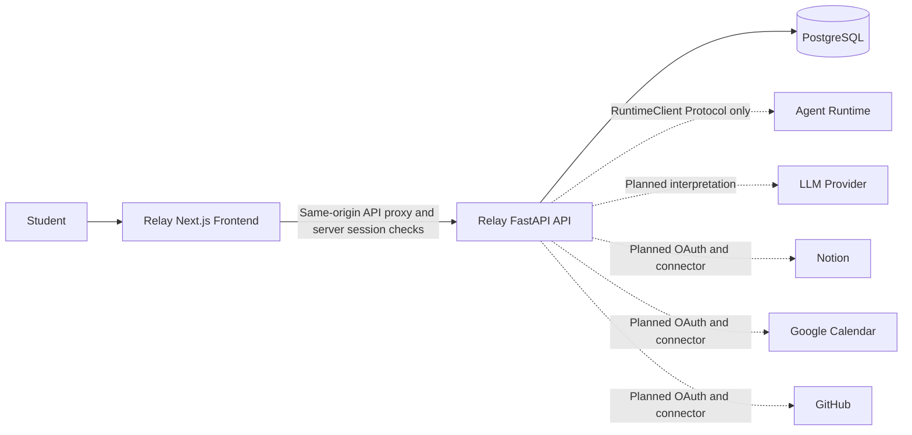

# System context

Solid edges are implemented relationships; dotted edges are planned integrations.

Relay accounts, sessions, preferences, draft runs, lifecycle services and approval persistence exist. Connected-account persistence and encryption exist but provider OAuth routes return 501. No external integration is contacted. Relay owns OAuth configuration and connector-specific domain logic; Runtime must remain independent of student and provider-domain concepts.
