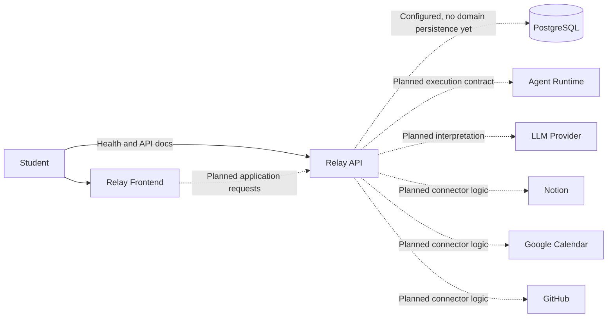

# System context

Relay is the student-facing application. Solid edges indicate current behavior; dotted edges indicate planned relationships. PostgreSQL is configured but stores no domain records yet.

The frontend links to API documentation; it does not yet fetch application data. External account configuration and provider-specific interpretation belong to Relay. Runtime is separate, and its eventual execution transport is unresolved. No external service is contacted in Phase 0.
