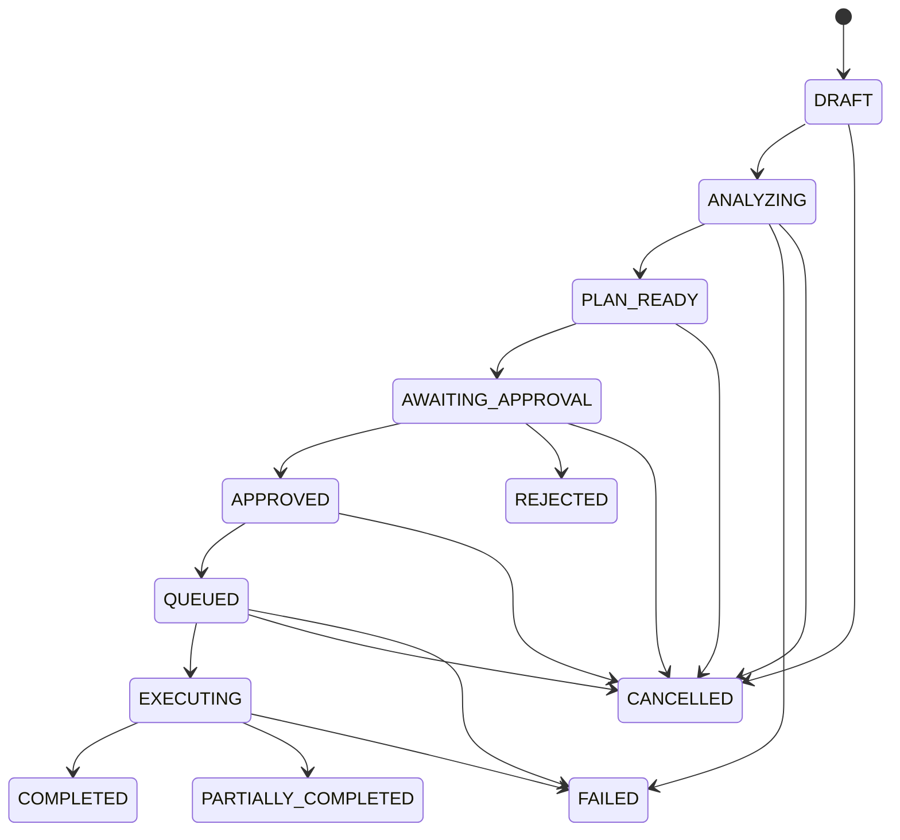

# Workflow state machine

`app/domain/workflows.py` is the single transition table. There is no endpoint that accepts an arbitrary workflow status. `POST /workflow-runs` creates DRAFT only. Planning/execution transitions are internal service methods for future workflows and are exercised using fixtures.

COMPLETED, PARTIALLY_COMPLETED, FAILED, REJECTED, and CANCELLED are terminal. Self-transitions and terminal-state exits fail with `InvalidWorkflowTransition`. There are no implicit retries/restarts. A future retry should be designed as a new run with provenance, not an undocumented state rewrite.

`WorkflowService.transition_workflow` verifies ownership, locks the run, applies the pure transition decision, persists timestamps, appends WORKFLOW_STATE_CHANGED, and commits atomically. `started_at` marks entry into ANALYZING; `completed_at` marks any terminal outcome; `updated_at` changes on every accepted transition. Internal composition uses `apply_transition` within a locked transaction.

## Approval gates

Entering AWAITING_APPROVAL requires a non-empty action set with pending requests. Every action must have an approved request before APPROVED or QUEUED. No public API can create proposed actions or trigger analysis/execution yet.

Request creation deep-copies the proposed payload. Approval requires PENDING, ownership, AWAITING_APPROVAL, and an exact JSON payload match against both the stored original and current action. Object key order is ignored; JSON scalar types, array order, and values are retained. Payload editing is deliberately not exposed. A changed proposal fails with a conflict instead of silently authorizing different work.

The exact approved snapshot is persisted and cannot be changed through supported APIs/ORM writes after resolution. Future executors must use this snapshot. Approving all actions moves the run to APPROVED but does not submit execution. Rejecting one action rejects the run and expires other pending requests. Duplicate approve/reject requests return 409, including concurrent resolutions serialized with a PostgreSQL parent-run lock. No second decision event is appended.

Execution states describe the future lifecycle; their presence is not evidence that workers or external writes exist. Cancellation from EXECUTING is intentionally unsupported because an in-flight external side effect cannot be assumed reversible.
