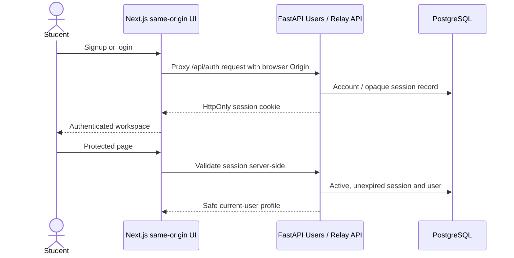

# Relay authentication

Relay uses [FastAPI Users](https://fastapi-users.github.io/fastapi-users/latest/configuration/overview/) for signup/login and the library's password hashing and database session strategy. The library uses pwdlib with Argon2. Relay adds password length validation (12-128 characters), profile fields, atomic user/preference/audit creation, and resource authorization. Password hashes are never serialized.

Browser requests use `/api/*` on the Next.js origin; rewrites target a server-only `API_INTERNAL_URL`. Protected page layouts validate the cookie against `/users/me` on the server, and every protected API endpoint separately requires an active authenticated user. The layout is a UX boundary, not the authorization authority: Next.js can reuse layouts during navigation.

Sessions are opaque random tokens managed by the library's [database strategy](https://fastapi-users.github.io/fastapi-users/latest/configuration/authentication/strategies/database/), not browser-stored JWTs. They expire after 24 hours by default. Logout deletes the current session record and clears the cookie, so replay fails. The library stores session tokens in the session table; database access is therefore sensitive. External provider tokens have separate authenticated encryption.

Cookies are HttpOnly, SameSite=Lax, path `/`, no Domain, and Secure by default. `COOKIE_SECURE=false` is explicitly local HTTP development only. Production requires HTTPS, Secure cookies, a private API network path, and an exact HTTPS `FRONTEND_ORIGIN`. Set `SESSION_LIFETIME_SECONDS` to a positive duration.

All unsafe HTTP methods require an exact allowed Origin, including signup/login/logout, preventing login CSRF as well as authenticated cross-origin writes. Missing/foreign origins fail closed. There is no wildcard CORS configuration. Command-line/API-doc clients must explicitly provide the configured Origin for writes. An Origin header is CSRF defense, not identity: protected resources still require the session.

Ownership always comes from the authenticated user. Run and approval queries join/filter the owner before returning a resource; foreign IDs return 404. Preferences and profile APIs have no client-selectable user ID. Connections are filtered by owner/provider, and disconnect cannot affect another user. No admin/user-list endpoint is enabled.

## Scope and remaining work

Relay login does not require Google, Notion, or GitHub. Provider OAuth is not a login mechanism here. No hosted auth vendor account is required to develop locally.

FastAPI Users is a mature library in [maintenance mode](https://github.com/fastapi-users/fastapi-users), so upgrades and security advisories need deliberate review. This choice avoids implementing password hashing and session token lifecycle from scratch. Before public deployment, add edge rate limiting/abuse protection, email verification, account recovery, expired-session cleanup, secure deployment configuration, and operational monitoring. Email delivery/reset endpoints are not enabled; do not imply that an unverified email proves identity. These production features are not implemented in this phase.
